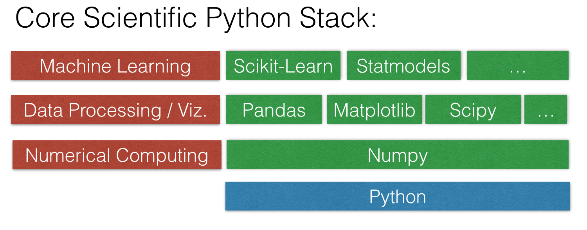

### Intro to Data Science - SF - Sep 2016 - Cohort 1

**Instructors:** 

* [Ramesh Sampath](https://www.linkedin.com/in/sampathweb)
* [T.J. Bay](https://www.linkedin.com/in/tjbay)

Course materials for [Metis' Introduction to Data Science Course](http://www.thisismetis.com/introduction-to-data-science) in San Francisco (9/6/16 - 10/20/16)

### [Course Project](projects/README.md)

###Schedule:
Tuesday | Thursday
--- | ---
9/6: [Introduction to Python and Version Control](#class-1-introduction-to-python-and-version-control) | 9/8: [Introduction to Linear Algebra and Statistics in Python](#class-2-introduction-to-linear-algebra-and-statistics-in-python)
9/13: [Pandas and Exploratory Data Analysis](#class-3-pandas-and-exploratory-data-analysis) | 9/15: [Pandas and Data Visualization](#class-4-pandas-and-data-visualization)
9/27: [Supervised Machine Learning and Basic Model Evaluation](#class-5-supervised-machine-learning-and-basic-model-evaluation) | 9/29: [Unsupervised Machine Learning and Basic Model Evaluation](#class-6-unsupervised-machine-learning-and-basic-model-evaluation)
10/4: [Advanced Supervised Learning](#class-7-advanced-supervised-learning) | 10/06: [Data Modeling: Feature Engineering and Basic Cross Validation](#class-8-feature-engineering-and-basic-cross-validation)
10/11: [Data Modeling: Regularization, Feature Decomposition](#class-9-feature-decomposition-and-regularization) | 10/13: [Advanced Model Evaluation and Pipelines](#class-10-advanced-model-evaluation-and-data-pipelines) 
10/18: [Advanced Unsupervised Learning](#class-11-advanced-unsupervised-learning) | 10/20: [Project Presentations and Course Wrap-up](#class-12-project-presentations-and-where-to-go-from-here)

### Before the Course Begins (Prework):
* Install [Git](http://git-scm.com/downloads).
* Create an account on [GitHub](https://github.com/).
    * It is not necessary to download "GitHub for Windows" or "GitHub for Mac"
* Install [SourceTree](https://www.sourcetreeapp.com) and sign into your github account through it.
* Install [slack](https://slack.com) and get the necessary credentials to communicate on the metis slack channels.
* Install the [Anaconda distribution](http://continuum.io/downloads).
* Complete exercises 1-7, 13, 18-21, 27-35, 38, 39 of [Learn Python The Hard Way](http://learnpythonthehardway.org/book/)
* Watch the [linear algebra review videos](https://class.coursera.org/ml-005/lecture/preview) from Andrew Ng’s excellent Coursera ML course. They are labeled III. Linear Algebra Review (Week 1).
* Complete the exercises in chapters 2 and 3 of [this open textbook](https://www.openintro.org/stat/textbook.php).
)

### Tools

-----

### Class 1: Introduction to Python and Version Control
* Welcome
* Briefly discuss the [course project](projects/README.md) and [public data sources](projects/public_data.md)
* Short Intro to Git / Github
* Intro to [SourceTree](https://www.sourcetreeapp.com)
* [Intro to IPython Notebooks](class_materials/01_intro_to_ipython_notebook.ipynb)
* [Intro to Python](class_materials/01_intro_to_python.ipynb)

* Wrap up: Getting help, course schedule, office hours

**Homework:**
* Finish whatever exercises from [LPTHW](http://learnpythonthehardway.org/book/) you couldn't finish. I assigned a lot of exercises as prework, so I suspect you have some things to work on. Focus on those concepts in the lecture that you didn't quite get.
* If your laptop has any setup issues, please work with me or someone else at Metis to resolve them by Thursday.

**Git Resources (IF you don't want to use Sourcetree):**
* [Pro Git](http://git-scm.com/book/en/v2) is an excellent book for learning Git if you don't want to use SourceTree. Read the first two chapters if you want to gain a deeper understanding of version control.
* If you want to really practice a lot of Git (and learn many more commands), try [Git Immersion](http://gitimmersion.com/).
* [GitRef](http://gitref.org/) is an excellent reference guide for Git commands.

-----

### Class 2: Introduction to Linear Algebra and Statistics in Python
* [Pair Monty Hall Problem](pair_problems/01_pair-monty-hall-sim.md)
* Introduction to Linear Algebra in Python ([notebook](class_materials/02_intro_linalg.ipynb))
* Introduction to Statistics in Python ([notebook](class_materials/02_intro_stats.ipynb))

**Homework:**
* Work through as much of the [NumPy quickstart guide](http://docs.scipy.org/doc/numpy-dev/user/quickstart.html) as you can.
* Work through the remainder of the statistics exercises in the prework.

-----

### Class 3: Pandas and Exploratory Data Analysis
* Using Pandas for Exploratory Data Analysis [notebook](class_materials/03_pandas_and_eda.ipynb)
* Using Pandas for More Exploratory Data Analysis [notebook](class_materials/03_pandas_and_more_eda.ipynb) 

**Resources:**
* The Pandas [API Reference](http://pandas.pydata.org/pandas-docs/stable/api.html) is well documented.
* To learn more Pandas, review this [three-part tutorial](http://www.gregreda.com/2013/10/26/intro-to-pandas-data-structures/).
* If you want to go all in on Pandas (and NumPy), the book [Python for Data Analysis](http://shop.oreilly.com/product/0636920023784.do) was written by the creator of Pandas. It is really great.
* Here are examples of different types of [joins in Pandas](http://www.gregreda.com/2013/10/26/working-with-pandas-dataframes/#joining), for when you need to figure out how to merge two DataFrames.

-----

### Class 4: Pandas and Data Visualization

* Visualization with Pandas and Matplotlib

**Visualization Resources:**
* Watch [Look at Your Data](https://www.youtube.com/watch?v=coNDCIMH8bk) (18 minutes) for an excellent example of why visualization is useful for understanding your data.
* [Plotting in Pandas notebook](http://nbviewer.ipython.org/github/fonnesbeck/Bios8366/blob/master/notebooks/Section2_7-Plotting-with-Pandas.ipynb) 
* The [visualization page](http://pandas.pydata.org/pandas-docs/stable/visualization.html) from the official Pandas documentation is fantastic.
*  [This notebook on matplotlib](http://nbviewer.ipython.org/github/fonnesbeck/Bios8366/blob/master/notebooks/Section2_4-Matplotlib.ipynb) or this [similar notebook](http://nbviewer.ipython.org/github/jrjohansson/scientific-python-lectures/blob/master/Lecture-4-Matplotlib.ipynb) are both very good for showing you how to use matplotlib effectively.
* To explore different types of visualizations and when to use them:
    * [Choosing a Good Chart](http://extremepresentation.typepad.com/files/choosing-a-good-chart-09.pdf)
    * [The Graphic Continuum](http://www.coolinfographics.com/storage/post-images/The-Graphic-Continuum-POSTER.jpg)
* This [PowerPoint presentation](http://www2.research.att.com/~volinsky/DataMining/Columbia2011/Slides/Topic2-EDAViz.ppt) from Columbia's Data Mining class contains lots of good advice for properly using different types of visualizations.

-----

### Class 5: Supervised Machine Learning and Basic Model Evaluation

* Read [this excellent blog post on understanding bias and variance](http://scott.fortmann-roe.com/docs/BiasVariance.html). It explains the basic tradeoff that all machine learning algorithms attempt to address in one way or another. This is also known as the "No Free Lunch" theorem.

**Machine Learning Resources:**
* For an in-depth introduction to machine learning, read section 2.1 (14 pages) of Hastie and Tibshirani's excellent book, [An Introduction to Statistical Learning](http://www-bcf.usc.edu/~gareth/ISL/).
* For a preview of some of the machine learning content we will cover during the course, read Sebastian Raschka's [overview of the supervised learning process](https://github.com/rasbt/pattern_classification/blob/master/machine_learning/supervised_intro/introduction_to_supervised_machine_learning.md).
* For fun, look up the [characteristics of your zip code](http://www.esri.com/landing-pages/tapestry/), and then read about the [67 distinct segments](http://doc.arcgis.com/en/esri-demographics/data/tapestry-segmentation.htm) in detail.

**Model Evaluation Resources:**
* For another explanation of training error versus testing error, the bias-variance tradeoff, and train/test split (also known as the "validation set approach"), watch Hastie and Tibshirani's video on [estimating prediction error](https://www.youtube.com/watch?v=_2ij6eaaSl0&t=2m34s) (12 minutes, starting at 2:34).
* Caltech's Learning From Data course includes a fantastic video on [visualizing bias and variance](http://work.caltech.edu/library/081.html) (15 minutes).
* [Random Test/Train Split is Not Always Enough](http://www.win-vector.com/blog/2015/01/random-testtrain-split-is-not-always-enough/) explains why random train/test split may not be a suitable model evaluation procedure if your data is time-based.

-----

### Class 6: Advanced Supervised Learning
* Ensembles: From Decision Trees to Random Forests [notebook](class_materials/06_from_decision_trees_to_random_forests.ipynb)

**Resources:**
* scikit-learn's documentation on [ensemble methods](http://scikit-learn.org/stable/modules/ensemble.html) covers both "averaging methods" (such as bagging and Random Forests) as well as "boosting methods" (such as AdaBoost and Gradient Tree Boosting).
* For an intuitive explanation of Random Forests, read Edwin Chen's answer to [How do random forests work in layman's terms?](http://www.quora.com/Random-Forests/How-do-random-forests-work-in-laymans-terms/answer/Edwin-Chen-1)
* [Interpretable vs Powerful Predictive Models: Why We Need Them Both](https://medium.com/@chris_bour/interpretable-vs-powerful-predictive-models-why-we-need-them-both-990340074979) is a short post on how the tactics useful in a Kaggle competition are not always useful in the real world.

-----

### Class 7: Unsupervised Machine Learning and Basic Model Evaluation
* Clustering ([notebook](class_materials/07_unsupervised_machine_learning_clustering.ipynb))
    * K-means: [visualization](http://www.naftaliharris.com/blog/visualizing-k-means-clustering/)
    * DBSCAN: [visualization](http://www.naftaliharris.com/blog/visualizing-dbscan-clustering/)

**Clustering Resources:**
* scikit-learn's documentation on [clustering](http://scikit-learn.org/stable/modules/clustering.html) compares many different types of clustering.
* For a very thorough introduction to clustering, read chapter 8 (69 pages) of [Introduction to Data Mining](http://www-users.cs.umn.edu/~kumar/dmbook/index.php) (available as a free download), or browse through the chapter 8 slides.
* An Introduction to Statistical Learning has a useful video on [K-means clustering](https://www.youtube.com/watch?v=aIybuNt9ps4&list=PL5-da3qGB5IBC-MneTc9oBZz0C6kNJ-f2) (17 minutes).
* Fun examples of clustering: [A Statistical Analysis of the Work of Bob Ross](http://fivethirtyeight.com/features/a-statistical-analysis-of-the-work-of-bob-ross/) (with [data and Python code](https://github.com/fivethirtyeight/data/tree/master/bob-ross)), [How a Math Genius Hacked OkCupid to Find True Love](http://www.wired.com/2014/01/how-to-hack-okcupid/all/).

-----

### Class 8: Feature Engineering and Basic Cross Validation
* Feature Engineering/Cross Validation [notebook](class_materials/08_feature_engineering_cross_validation.ipynb)
    
**Feature Engineering/Selection Resources:**
* Machine Learning Mastery: [An Introduction to Feature Selection](http://machinelearningmastery.com/an-introduction-to-feature-selection/)
* [StandardScaler](http://scikit-learn.org/stable/modules/generated/sklearn.preprocessing.StandardScaler.html)
* Here is a longer example of [feature scaling](http://nbviewer.ipython.org/github/rasbt/pattern_classification/blob/master/preprocessing/about_standardization_normalization.ipynb) in scikit-learn, with additional discussion of the types of scaling you can use.
* Section 3.3.1 of [An Introduction to Statistical Learning](http://www-bcf.usc.edu/~gareth/ISL/) (4 pages) has a great explanation of dummy encoding for categorical features.
* These examples may help you to better understand the process of feature engineering: 
    * [predicting the number of passengers at a train station](https://medium.com/@chris_bour/french-largest-data-science-challenge-ever-organized-shows-the-unreasonable-effectiveness-of-open-8399705a20ef)
    * [identifying fraudulent users of an online store](https://docs.google.com/presentation/d/1UdI5NY-mlHyseiRVbpTLyvbrHxY8RciHp5Vc-ZLrwmU/edit#slide=id.p)
    * [identifying bots in an online auction](https://www.kaggle.com/c/facebook-recruiting-iv-human-or-bot/forums/t/14628/share-your-secret-sauce)
    * [predicting who will subscribe to the next season of an orchestra](http://blog.kaggle.com/2015/01/05/kaggle-inclass-stanfords-getting-a-handel-on-data-science-winners-report/)
    * [evaluating the quality of e-commerce search engine results](http://blog.kaggle.com/2015/07/22/crowdflower-winners-interview-3rd-place-team-quartet/).

**Cross-Validation Resources:**
* scikit-learn documentation: 
    * [Cross-validation](http://scikit-learn.org/stable/modules/cross_validation.html)
    * [Model evaluation](http://scikit-learn.org/stable/modules/model_evaluation.html)
* scikit-learn issue on GitHub: [MSE is negative when returned by cross_val_score](https://github.com/scikit-learn/scikit-learn/issues/2439)
* Section 5.1 of [An Introduction to Statistical Learning](http://www-bcf.usc.edu/~gareth/ISL/) (11 pages) and related videos: 
    * [K-fold and leave-one-out cross-validation](https://www.youtube.com/watch?v=nZAM5OXrktY) (14 minutes)
    * [Cross-validation the right and wrong ways](https://www.youtube.com/watch?v=S06JpVoNaA0) (10 minutes)
* Scott Fortmann-Roe: [Accurately Measuring Model Prediction Error](http://scott.fortmann-roe.com/docs/MeasuringError.html)
* Harvard CS109: [Cross-Validation: The Right and Wrong Way](http://nbviewer.ipython.org/github/cs109/content/blob/master/lec_10_cross_val.ipynb)
* Journal of Cheminformatics: [Cross-validation pitfalls when selecting and assessing regression and classification models](http://www.jcheminf.com/content/pdf/1758-2946-6-10.pdf)

-----

### Class 9: Feature Decomposition and Regularization
* Feature Decomposition and Regularization: PCA, Lasso/L1 Regularization, Ridge/L2 Regularization [notebook](class_materials/09_feature_decomposition_regularization.ipynb)

**PCA Resources**
* Jeremy Kun's [blog](https://jeremykun.com) is an excellent source of "mathy" explanations of a variety of algorithms and approaches used in Data Science, but I find his explanation of [PCA](https://jeremykun.com/2012/06/28/principal-component-analysis/) is especially good.
* Sebastian Raschka's [explanation of PCA](http://sebastianraschka.com/Articles/2015_pca_in_3_steps.html) is also very informative. In general, you should use/understand the method as more for explanatory than for predictive purposes.

**Regularization Resources:**
* This [notebook](http://nbviewer.ipython.org/github/luispedro/PenalizedRegression/blob/master/PenalizedRegression.ipynb) from chapter 7 of [Building Machine Learning Systems with Python](https://www.packtpub.com/big-data-and-business-intelligence/building-machine-learning-systems-python) has a nice long example of regularized linear regression.
* The scikit-learn user guide for [Generalized Linear Models](http://scikit-learn.org/stable/modules/linear_model.html) explains the different variations of regularization.
* Section 6.2 of [An Introduction to Statistical Learning](http://www-bcf.usc.edu/~gareth/ISL/) (14 pages) introduces both ridge regression and lasso regression. Or, watch the related videos on [ridge regression](https://www.youtube.com/watch?v=cSKzqb0EKS0&list=PL5-da3qGB5IB-Xdpj_uXJpLGiRfv9UVXI&index=6) (13 minutes) and [lasso regression](https://www.youtube.com/watch?v=A5I1G1MfUmA&index=7&list=PL5-da3qGB5IB-Xdpj_uXJpLGiRfv9UVXI) (15 minutes).
* Caltech's Learning From Data course has a great video introducing [regularization](http://work.caltech.edu/library/121.html) (8 minutes) that builds upon their video about the [bias-variance tradeoff](http://work.caltech.edu/library/081.html).
* For a math-ier explanation of regularization, watch the last four videos (30 minutes) from week 3 of Andrew Ng's [awesome and famous machine learning course](https://www.coursera.org/learn/machine-learning/home/info), or read the [related lecture notes](http://www.holehouse.org/mlclass/07_Regularization.html) compiled by a student.
* There are some special considerations when using dummy encoding for categorical features with a regularized model. [This Cross Validated Q&A](https://stats.stackexchange.com/questions/69568/whether-to-rescale-indicator-binary-dummy-predictors-for-lasso) debates whether the dummy variables should be standardized (along with the rest of the features), and a comment on this [blog post](http://appliedpredictivemodeling.com/blog/2013/10/23/the-basics-of-encoding-categorical-data-for-predictive-models) recommends that the baseline level should not be dropped.

-----

### Class 10: Advanced Model Evaluation and Data Pipelines
* Advanced model evaluation and data pipelines [notebook](class_materials/10_advanced_model_evaluation_and_pipelines.ipynb)
    * Null accuracy
    * Confusion matrix
    * Sensitivity, Specificity, Recall, Precision, all the metrics
    * ROC curves and AUC
    * Data Pipelines

**ROC Resources:**
* Rahul Patwari has a great video on [ROC Curves](https://www.youtube.com/watch?v=21Igj5Pr6u4) (12 minutes).
* [An introduction to ROC analysis](http://people.inf.elte.hu/kiss/13dwhdm/roc.pdf) is a very readable paper on the topic.
* These [lesson notes](http://ebp.uga.edu/courses/Chapter%204%20-%20Diagnosis%20I/8%20-%20ROC%20curves.html) from a course at the University of Georgia (my alma mater!) include some simple, real-world examples of the use of ROC curves.
* ROC curves can be used across a wide variety of applications, such as [comparing different feature sets](http://research.microsoft.com/pubs/205472/aisec10-leontjeva.pdf) for detecting fraudulent Skype users, and [comparing different classifiers](http://www.cse.ust.hk/nevinZhangGroup/readings/yi/Bradley_PR97.pdf) on a number of popular datasets.
* This blog post about [Amazon Machine Learning](https://aws.amazon.com/blogs/aws/amazon-machine-learning-make-data-driven-decisions-at-scale/) contains a neat [graphic](https://media.amazonwebservices.com/blog/2015/ml_adjust_model_1.png) showing how classification threshold affects different evaluation metrics.
* scikit-learn has an incredibly active [mailing list](https://www.mail-archive.com/scikit-learn-general@lists.sourceforge.net/index.html) that is often much more useful than Stack Overflow for researching a particular function.

**Pipeline Resources:**
* [Pipeline](http://scikit-learn.org/stable/modules/pipeline.html): chaining steps into a single, repeatable data flow
* [Practical Data Science in Python](http://radimrehurek.com/data_science_python/) is a long and well-written notebook that includes the use of scikit-learn's Pipeline.

-----
